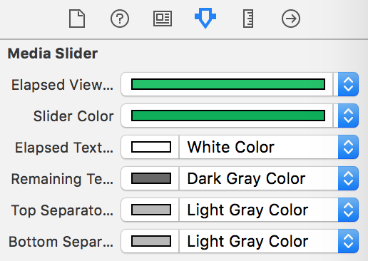

# MVMediaSlider
MVMediaSlider is a UIControl subclass inspired by the [Overcast App](https://itunes.apple.com/app/id888422857).


[](http://mit-license.org)
[](https://developer.apple.com/resources/)
[](https://developer.apple.com/swift)
[](https://github.com/bizz84/MVMediaSlider/issues)
[](http://cocoadocs.org/docsets/MVMediaSlider/)

## Preview


## Installation
MVMediaSlider can be installed as a Cocoapod and builds as a Swift framework. To install, include this in your Podfile.

```
use_frameworks!

pod 'MVMediaSlider'
```

* Run `pod install`, then open the Xcode workspace
* Add a `UIView` to the desired view controller in IB, and set `MVMediaSlider` as the custom class name:


*  Add the auto layout constraints to the new view (recommended values are edge to edge and a height of 25pt).
*  Hit `CMD+Option+4` to open the view attributes and set the desired properties:



* ```import MVMediaSlider``` in your view controller to use MVMediaSlider as an `@IBOutlet`. 
* Build and run your app.


## Sample Code
The project includes a demo app showing how to build a simple audio player using `MVMediaSlider` to change the playback position.


## Features
* Register to `UIControlEvents.ValueChanged` to handle changes in the playback position (same target/selector method used by `UIControl`/`UISlider`).
* `@IBDesignable` properties for easier configuration in Interface builder
* Seamless integration in existing storyboards: Just drag a UIView, set the class type to `MVMediaSlider` and configure the presentation properties as needed.

### Configurable properties


* Elapsed View Color
* Slider Color
* Elapsed Text Color
* Remaining Text Color
* Elapsed View Color
* Top Separator Color
* Bottom Separator Color


## License

Copyright (c) 2016 Andrea Bizzotto bizz84@gmail.com

Permission is hereby granted, free of charge, to any person obtaining a copy of this software and associated documentation files (the "Software"), to deal in the Software without restriction, including without limitation the rights to use, copy, modify, merge, publish, distribute, sublicense, and/or sell copies of the Software, and to permit persons to whom the Software is furnished to do so, subject to the following conditions:

The above copyright notice and this permission notice shall be included in all copies or substantial portions of the Software.

THE SOFTWARE IS PROVIDED "AS IS", WITHOUT WARRANTY OF ANY KIND, EXPRESS OR IMPLIED, INCLUDING BUT NOT LIMITED TO THE WARRANTIES OF MERCHANTABILITY, FITNESS FOR A PARTICULAR PURPOSE AND NONINFRINGEMENT. IN NO EVENT SHALL THE AUTHORS OR COPYRIGHT HOLDERS BE LIABLE FOR ANY CLAIM, DAMAGES OR OTHER LIABILITY, WHETHER IN AN ACTION OF CONTRACT, TORT OR OTHERWISE, ARISING FROM, OUT OF OR IN CONNECTION WITH THE SOFTWARE OR THE USE OR OTHER DEALINGS IN THE SOFTWARE.


